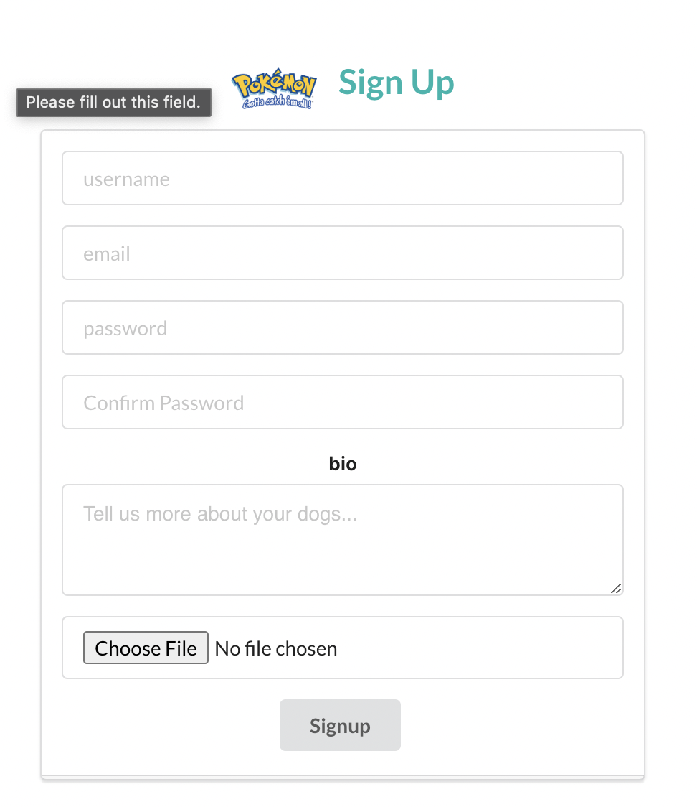
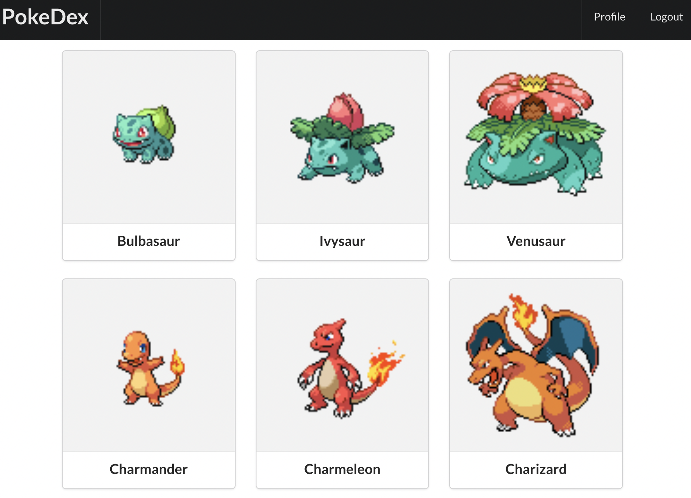
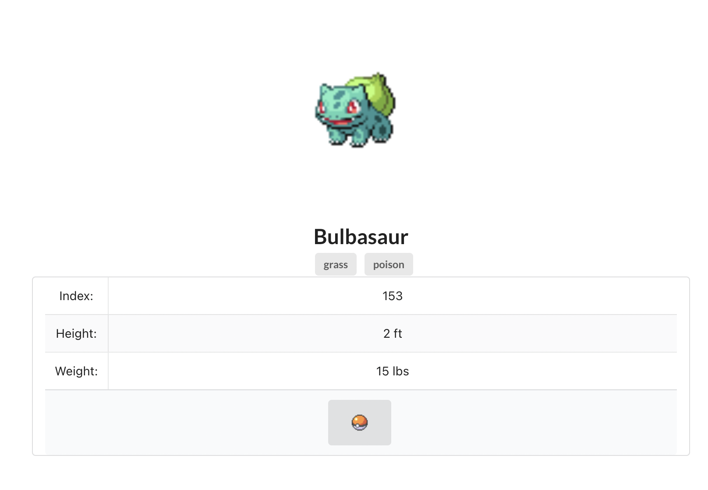
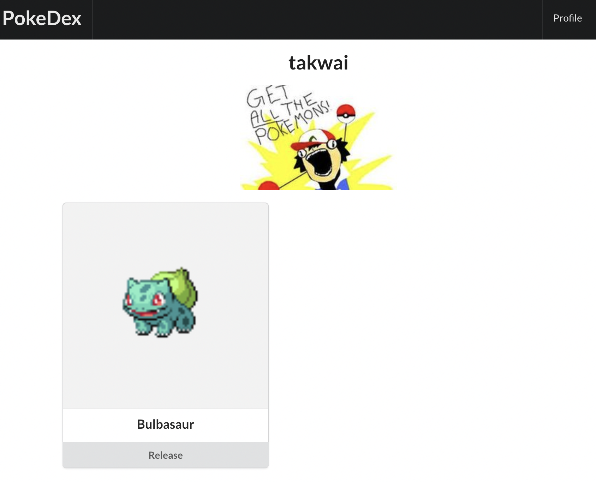
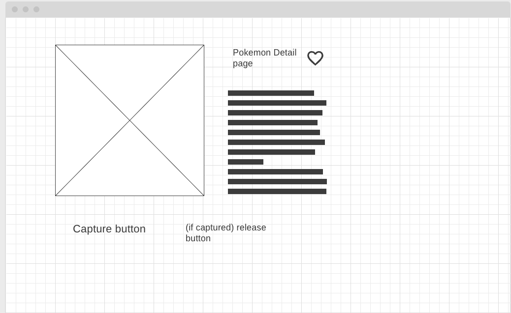
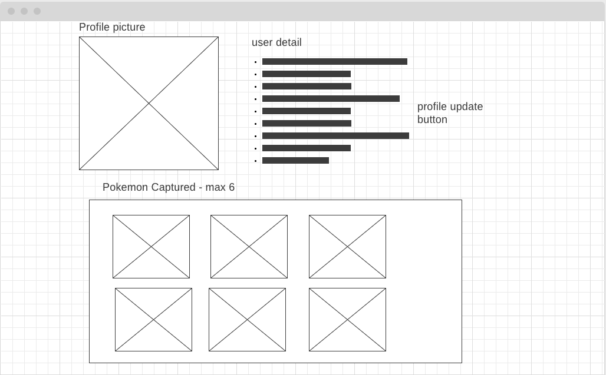
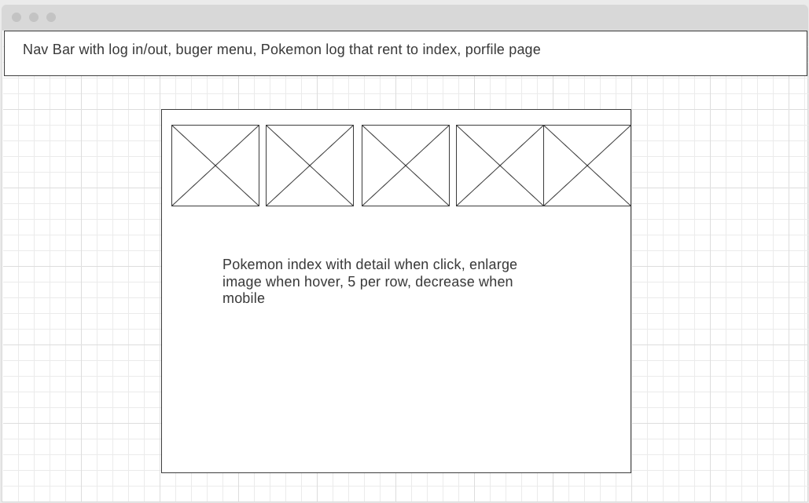
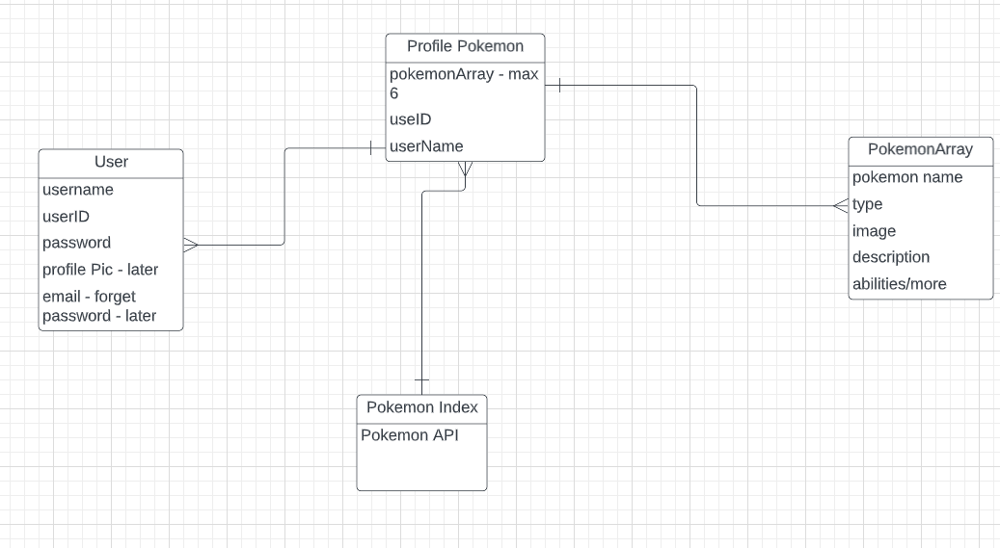

#Pokedex

##Index of original 151 pokemon
able to catch pakemon
detail about the pokemon

##Screenshot

##Technologies Used: 
- MongoDB
- Express
- React
- Node
- Pokemon API
- Semantic UI

This application was deployed on Heroku [link to application](https://pokedexwithminigame.herokuapp.com/).
###[Trello](https://trello.com/b/UvnB9QR6/project-4-pokedex).

##Wireframe

##ERD

##Next Steps: 
- improve index page.
- improve detail page.
- improve profile page.
- add mini game for catching pokemon

